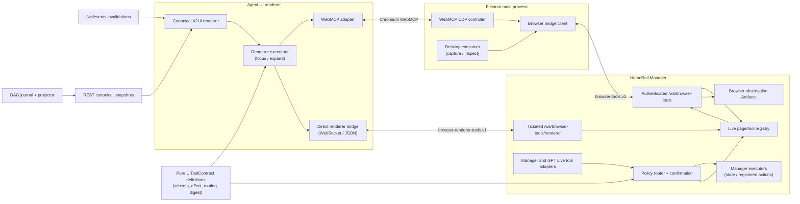

# Experimental Browser Agent Bridge

Status: feasibility accepted as **Partial Go**; first vertical slice implemented

Scope: HomeRail core + HomeRail Desktop

Decision date: 2026-08-09

Tracking:

- HomeRail core: [xiaotianfotos/homerail#208](https://github.com/xiaotianfotos/homerail/issues/208)
- Electron Desktop: [xiaotianfotos/homerail_desktop#50](https://github.com/xiaotianfotos/homerail_desktop/issues/50)

Delivery uses two repository-sized tasks and two pull requests, implemented
serially. The detailed phases below are checklists inside those two tasks, not
independent parallel Issues.

This document defines an opt-in browser-agent bridge for HomeRail. The bridge
combines stable HomeRail UI contracts, a browser-neutral renderer transport,
the experimental WebMCP page API when available, a narrowly scoped
Electron/CDP observation layer, Manager-side policy, and HomeRail Artifacts.
It deliberately does not replace HomeRail's Generative UI, A2UI, DAG
projection, or event channels.

## Decision

Proceed behind an experimental, default-off feature gate.

The feasibility gate passed for the HomeRail UI loaded by Electron 43:

- Electron 43 embeds Chromium 150.
- With the WebMCP feature enabled before Electron startup,
  `document.modelContext` is available in the renderer.
- A local imperative tool was registered, listed, and executed successfully.
- Electron's attached DevTools Protocol exposes the experimental `WebMCP`
  domain.
- `WebMCP.enable` emitted the registered catalog and
  `WebMCP.invokeTool` completed end to end with a structured response.

The implementation must still probe capabilities at runtime. The WebMCP API,
Chromium feature names, and CDP domain are experimental and may change without
following Electron's compatibility guarantees.

Native WebMCP support is therefore not a prerequisite for semantic HomeRail UI
control. A separately authenticated renderer connection invokes the same six
frozen application contracts over standard WebSocket/JSON. This path works in
the Web deployment and remains available in Electron when its embedded
Chromium lacks the page API or CDP domain. Native WebMCP is an optional page
discovery/invocation adapter; it is not the product's compatibility boundary.

### Go, no-go, and deferred decisions

| Area | Decision | Reason |
| --- | --- | --- |
| Experimental WebMCP toggle | Go | Electron 43 can enable and execute it; default-off and restart-required are acceptable. |
| Dedicated `/ws/browser-tools` | Go | The existing `/ws/events` channel is a broadcast invalidation stream, not authenticated RPC. |
| Browser-neutral renderer bridge | Go | The six frozen HomeRail contracts need only WebSocket, JSON, AbortController, and the existing UI controller; no vendor browser API is required. |
| HomeRail UI tools | Go | Stable HomeRail state and actions can be wrapped without coordinate clicking. |
| Widget/page screenshots | Go | Electron `capturePage()` and CDP screenshot APIs are available; images belong in Artifacts, not WS payloads. |
| Widget runtime inspection | Go, bounded | Box, visibility, overflow, partial accessibility, and selected style facts are useful; unrestricted DOM/CDP is not. |
| Manager visual feedback | Go, advisory first | A revision-bound screenshot plus semantic evidence can be evaluated, but subjective scores are not correctness proofs. |
| GPT Live UI operation | Go, stable tools first | The current Live runtime already executes application-owned function tools. |
| Read-only built-in MCP configuration | Go, as a provider catalog | Existing built-in tools can be described, but not all are literal MCP servers. |
| Replace A2UI/Generative UI with WebMCP | No-go | HomeRail's canonical document owns durability/revisions, A2UI owns declarative presentation, and WebMCP owns page-local callable actions. |
| Replace DAG events with WebMCP | No-go | WebMCP is not a state log, server-push protocol, replay mechanism, or recovery channel. |
| Expose arbitrary JavaScript or CDP commands | No-go | It would grant browser-debugger authority far beyond the product use case. |
| Unhide the existing external MCP editor | No-go for this delivery | Its CRUD exists, but configured servers are not wired into the Agent runtime and its runtime status is synthetic. |
| Arbitrary third-party browsing | Deferred | Desktop currently loads HomeRail UI and opens external links in the system browser. Multi-tab/origin policy needs a separate spike. |
| Directly inject every dynamic page tool into GPT Live | Deferred | OpenAI supports tool updates, but HomeRail's current Live runtime freezes a tool digest and reconnects on schema change; navigation-driven churn needs an explicit design. |

## How this maps to the requested product

| Requested capability | Proposed implementation |
| --- | --- |
| Turn browser-agent tools on or off | One default-off experimental setting. Web enable/disable is immediate; Desktop enable needs one restart to load the optional Chromium feature, while disable revokes both transports immediately. |
| Show built-in MCP configuration | A read-only **MCP & Tool Providers** catalog generated from real HomeRail tool declarations and runtime presence. |
| Add `/ws/browser-tools` | A versioned, authenticated Desktop-main-process-to-Manager RPC channel. |
| Support the deployed Web UI and non-Chrome browsers | A separate ticket-authenticated `/ws/browser-tools/renderer` channel invokes only the frozen HomeRail contracts and binds every turn to the exact originating tab/navigation. |
| Move Generative UI/DAG notifications to WebMCP | Do not migrate them. Keep canonical Generative UI/A2UI and `/ws/events`; expose selected UI observations and actions through the new bridge. |
| Screenshot the UI or one widget | Desktop captures pixels; Manager stores a bounded, revision-bound browser-observation Artifact. |
| Report widget details and quality | Combine the canonical semantic node, bounded runtime facts, partial accessibility data, screenshot, and a structured evaluation Artifact. |
| Let GPT Live operate the UI | Project a small stable set of application-owned function tools into the existing Live runtime; route mutations through HomeRail permissions and confirmation. |
| Open one DAG status by voice | Resolve an exact run ID or unique semantic DAG query in Manager, then invoke `ui_open_surface(surface="dag_status")`; one semantic call replaces opening the dashboard, choosing a run, and opening its view. |
| Close the DAG status by voice | Invoke `ui_close_surface(surface="dag_status")`; no selector, coordinate, or synthetic input event is involved. |

## The layers must remain distinct

`MCP`, `WebMCP`, `A2UI`, the HomeRail event stream, and browser inspection are
related but not interchangeable.

| Layer | Owns | Does not own |
| --- | --- | --- |
| HomeRail Generative UI | Canonical document, node revisions, transactions, actions, Artifacts, recovery | Browser tool discovery |
| A2UI profile | Declarative component graph, data bindings, renderer contract, user events | Network transport, page automation, screenshots |
| DAG Activity + Live Surface Projector | Durable facts and trusted projection into canonical A2UI | Direct browser actuation |
| `/ws/events` | Manager-to-UI invalidation hints; REST remains authoritative | Privileged bidirectional RPC |
| WebMCP | Page-local structured tool registration, discovery, invocation, cancellation | Screenshots, DOM/AX/CSS inspection, backend MCP replacement |
| Browser observation | Pixels and bounded facts about the rendered result | Canonical product state |
| MCP & Tool Provider catalog | Product-visible declarations and ephemeral runtime presence | Starting arbitrary external servers in its first version |

The current implementation is only partly hand-written. HomeRail has a custom
canonical UI transaction model and custom event envelopes, while its component
payload is a pinned, bounded A2UI v1.0 profile. WebMCP can remove some brittle
page actuation, but it cannot replace either the canonical model or the event
plane.

## Goals

- Give Manager agents a structured, auditable view of available HomeRail UI
  operations.
- Make the capability optional and preserve identical behavior when disabled or
  unsupported.
- Let Desktop discover and invoke WebMCP tools without exposing Node.js or a
  generic JavaScript evaluator to the renderer or Manager.
- Let the deployed Web UI expose the same semantic controls without depending
  on Chrome, Edge, `document.modelContext`, or CDP.
- Capture the whole HomeRail page or one stable widget as a bounded Artifact.
- Describe rendered widget facts without reconstructing business semantics from
  the DOM.
- Reuse the existing Generative UI Action Registry and `PluginActionBus`
  revision fences, permissions, confirmation, and audit model for the plugin
  actions they actually own.
- Give text Manager agents and GPT Live a consistent, small browser-tool
  interface.
- Keep repository ownership explicit while implementing the core and Desktop
  changes serially in one cohesive pull request per repository.

## Non-goals

- Replacing the canonical Generative UI document or A2UI renderer.
- Replacing DAG journals, projectors, REST snapshots, or `/ws/events`.
- Building a general Chrome DevTools remote control service.
- Exposing raw DOM, cookies, storage, network traffic, arbitrary CSS, arbitrary
  JavaScript, or arbitrary CDP methods to an Agent.
- Treating a WebMCP annotation as proof that an action is safe.
- Sending screenshot bytes as JSON/base64 over WebSocket.
- Automatically rewriting a widget until a model says it looks good.
- Enabling external MCP server execution from the existing dormant CRUD.
- Operating arbitrary third-party web pages in the first release.
- Expanding compatibility beyond browsers capable of loading the existing
  Agent UI build; the renderer bridge does not polyfill the application itself.

## Proposed architecture



### Trust boundaries

1. The Agent UI renderer remains sandboxed with context isolation and no Node
   integration.
2. Only Electron main attaches `webContents.debugger`; no remote debugging port
   is opened in production.
3. The Desktop main process, not the renderer, owns `/ws/browser-tools`.
4. A Web page never receives the Desktop pairing credential. It uses the
   separate `/ws/browser-tools/renderer` protocol with a single-use,
   short-lived ticket obtained through the exact same-origin UI proxy.
5. Manager is the authorization and audit boundary. Desktop and the renderer
   execute only a
   fixed protocol allowlist.
6. V1 canonical mutations are limited to registered Generative UI plugin
   actions and pass through `PluginActionBus`. Other Workspace/DAG mutations
   remain out of scope until they have an equally explicit command broker.
7. Tool descriptions, schemas, page outputs, screenshots, DOM facts, and
   accessibility text are untrusted inputs.

### Why the Desktop main process is the bridge client

- It already owns the `BrowserWindow` and invokes/monitors Manager through the
  HomeRail CLI.
- Electron exposes CDP through `webContents.debugger` in the main process.
- It can capture pixels without weakening renderer isolation.
- It can hold an OS-user-scoped pairing credential without exposing it to page
  JavaScript.
- A compromised page cannot connect itself as a privileged Desktop executor.

Desktop does not directly own the Manager child process: it may connect to a
Manager that was already running, and the status URL may be a configured public
access URL. Browser Bridge must therefore use a separately reported and
validated local control URL. It must never infer a loopback endpoint by
rewriting the public URL.

The native CDP path remains limited to the HomeRail Agent UI `webContents`.
The direct renderer path is part of the first release and is intentionally
limited to the same HomeRail Agent UI and the same frozen contracts; it is not
a general web-page automation bridge.

## Experimental feature lifecycle

Expose one user-facing switch:

```text
Experimental browser agent tools: Off | On
```

Default is `Off`. In the Web deployment, enable and disable are immediate. In
Desktop, first-time enable requires a restart because the optional Chromium
feature must be selected before `app.ready`. Disabling is immediate: restart is
needed only to remove the already-loaded experimental Chromium feature from the
process.

In Desktop the switch is process configuration, not an ordinary renderer or
Manager preference. Agent Settings writes it through one narrowly scoped
preload IPC method whose sender is checked against the exact HomeRail window
and origin. Desktop persists it in its own bounded configuration and applies
the native feature choice on the next launch. In a Web-only UI the switch is a
page preference and controls only the direct renderer path. Neither form ever
exposes a pairing credential, ticket after use, connection proof, or a generic
settings/file IPC surface.

Runtime disable is a fail-closed state transition:

```text
active
  -> reject new Manager calls
  -> unregister page tools / abort renderer registrations
  -> cancel safe in-flight work and mark uncertain mutations indeterminate
  -> invalidate catalog and page context
  -> close /ws/browser-tools and /ws/browser-tools/renderer
  -> detach webContents.debugger
  -> disabled_runtime (restart later unloads the Chromium feature)
```

The UI reports the capability as off as soon as this transition completes. A
failed cleanup keeps calls denied and reports a diagnostic; it never leaves the
toggle visually off while accepting new work.

The target design has three independently reportable policy capabilities:

| Capability | Meaning |
| --- | --- |
| `catalog` | Discover page tools and show connection/runtime state. |
| `observe` | Capture bounded HomeRail page/widget evidence. |
| `act` | Invoke approved UI tools; canonical mutations still require normal permission/confirmation. |

Initial product settings expose only one `On` switch. The implemented first
slice negotiates `catalog` and `act`; `observe` is added to capability
negotiation only when the capture/inspection executor exists. This avoids
advertising screenshot authority that Desktop cannot yet exercise. The target
protocol keeps all three independently disableable for enterprise policy or a
future settings UI.

Startup sequence:

1. Desktop reads the persisted experimental setting before Electron is ready.
2. If enabled, Desktop selects the validated Chromium feature set.
3. Desktop may attach CDP while the trusted first-run loading page is visible,
   but keeps the catalog empty until the exact configured HomeRail UI origin
   commits. A different loopback port or hostname is not equivalent.
4. Desktop probes the `WebMCP` domain; it never assumes support from a version
   number.
5. Chromium applies the page API's origin-isolation and `tools` Permissions
   Policy requirements. The first slice additionally limits Desktop projection
   to the top frame, exact HomeRail origin, and exact application-owned contract;
   a formal compatibility fixture will make those browser prerequisites visible.
6. Desktop connects to Manager with an authenticated `browser-tools.v1` hello.
7. When the experiment is enabled, Agent UI obtains a single-use renderer
   ticket through its same-origin UI endpoint and connects to
   `/ws/browser-tools/renderer` using only standard browser APIs.
8. Agent UI additionally registers native page tools when
   `document.modelContext` exists and the native capability probe succeeded.
9. Any missing native capability is reported as unavailable/unsupported, not
   treated as a fatal Desktop initialization failure. The direct renderer path
   remains eligible.

The formal compatibility test owns the exact feature-name matrix. The local
probe succeeded with `WebMCP`; upstream Chrome documentation also refers to
testing/DevTools support features. Production code must not accumulate guessed
feature names.

### Browser compatibility and fallback

Capability detection is based on APIs, not the user-agent string:

| Runtime | Semantic Manager/voice UI control | Native WebMCP projection | Electron capture/inspection |
| --- | --- | --- | --- |
| Electron with WebMCP CDP | Direct renderer bridge | Yes, after runtime probe | Yes |
| Electron without WebMCP CDP | Direct renderer bridge | Unavailable, visible and non-fatal | Other supported CDP/Electron observation features only |
| Chrome or Edge Web deployment | Direct renderer bridge | Optional when the page API exists | No |
| Firefox or Safari Web deployment | Direct renderer bridge | No | No |
| Browser unable to load the current Agent UI build | Unsupported | No | No |

An unsupported native method is a terminal capability result for that Desktop
process. Desktop detaches its debugger and does not repeatedly attach every
service-health poll. Transient transport failures use bounded exponential
backoff. Manager and settings distinguish an authenticated, complete catalog
from a socket that merely opened.

Every Manager, Worker, voice-stream, and Live turn freezes one explicit route:
`renderer`, `desktop`, or `none`. A renderer route also freezes
`connection_id`, `ui_session_id`, `tab_id`, and `navigation_id`. A stale or
disconnected target fails closed; it never falls through to Desktop or another
tab, even if only one other connection remains.

## Browser renderer protocol v1

The Web-compatible transport is deliberately separate from the Desktop
pairing protocol:

- Ticket endpoint: `/api/browser-tools/renderer-ticket`.
- WebSocket endpoint: `/ws/browser-tools/renderer`.
- The ticket is random, single-use, short-lived, cache-disabled, bound to the
  exact Origin and page identity, and sent as the first WebSocket message. It
  never appears in a URL or persistent browser storage.
- The public/static UI proxy validates the browser-facing Host and Origin,
  strips forwarding headers, and proxies only the exact renderer path. The
  privileged Desktop endpoint remains loopback-only and is never exposed by
  the Web proxy.
- The renderer declares the exact six application-owned contract digests.
  Arbitrary page tools and runtime schemas are rejected.
- Invocation and result messages bind connection, navigation, contract,
  deadline, size, and concurrency. Cancellation, navigation, timeout, and
  disconnect are single-terminal-state operations; uncertain visible actions
  are reported as indeterminate and are never replayed automatically.
- Multiple tabs coexist in a connection directory. The page that originates a
  turn supplies its server-issued opaque connection reference; Manager never
  selects the latest, focused, or only remaining tab as an implicit fallback.

This ticket proves that a page reached the trusted same-origin endpoint; it is
not a replacement for user authentication. The current single-user deployment
may use it behind the existing UI network boundary. A public multi-user
deployment must first bind ticket issuance and turn targets to an authenticated
principal (or a trusted reverse-proxy identity). Manager's control port must
remain private in either topology.

## Browser Tools protocol v1

### Transport and authentication

- Endpoint: `/ws/browser-tools`.
- Client: Electron main process in v1.
- Network binding: an explicit Manager local-control URL whose resolved host is
  loopback. The Manager serves this upgrade only on its local-control listener,
  verifies the socket peer address is loopback, and keeps the route absent from
  public/static reverse-proxy routing. Requests carrying proxy-forwarding
  headers are rejected on this endpoint. A public `managerAccessUrl` is never
  accepted for v1.
- Pairing: Desktop and Manager possess an OS-user-scoped browser-bridge
  credential stored outside web content with Unix mode `0600` or equivalent
  Windows ACL. Manager creates or repairs it in the shared HomeRail data home;
  Desktop only reads it. No unauthenticated HTTP endpoint reveals or creates
  the credential.
- Authentication: after a loopback-only upgrade, Manager sends a random nonce
  and HMAC proof. Desktop verifies it, then responds with its own random nonce,
  process instance identity, requested capability set, and a proof bound to all
  those values. Only then does Manager mark that socket ready. The credential
  is never sent over the connection or placed in a URL.
- Loopback, absence of an `Origin` header, or knowledge of the port is never
  sufficient authentication.
- Each authenticated socket binds its negotiated capabilities, Desktop process
  instance ID, random connection ID, and one connection lifetime.
- Manager restart invalidates connections; Desktop repeats the challenge with
  the durable pairing credential. Desktop restart creates a new instance
  identity. Credential rotation/revocation invalidates the old key and requires
  explicit repair if the peers no longer agree.
- A missing, unreadable, overly permissive, or mismatched credential makes the
  bridge unavailable. It never falls back to unauthenticated loopback.
- A browser client, if added later, must also pass an exact Origin allowlist.

The live-voice ticket and Origin checks are useful patterns, but browser tools
use a separate credential, audience, and scope. The implementation must
validate the concrete cross-platform credential and challenge flow; the
Desktop service supervisor does not provide or assume a Manager-child secret.

This pairing model protects against remote clients, other OS users, accidental
public exposure, and a sandboxed renderer that cannot read the credential. It
does not protect against a malicious process already running as the same OS
user, which can read the same user-owned secret and control the user's Desktop
session. Defending that stronger host-compromise case would require
platform-attested application identity or protected broker IPC and is out of
scope for v1; the limitation must remain explicit in threat documentation.

### Opaque context identity

Every catalog entry, invocation, capture, and result is bound to:

```ts
interface BrowserContextRefV1 {
  desktop_instance_id: string
  page_id: string
  frame_id: string
  navigation_id: string
  origin: string
}
```

`page_id`, `frame_id`, and `navigation_id` are opaque outside Desktop. Raw
Electron `webContents.id` and raw CDP target/session identifiers are not a
public control surface.

Navigation always creates a new `navigation_id`. A request referring to an old
navigation fails closed even if a tool with the same name reappears.

### Tool identity

```ts
interface BrowserToolRefV1 {
  context: BrowserContextRefV1
  name: string
  catalog_revision: number
  page_descriptor_digest: string
  contract_id: string
  contract_digest: string
}
```

Names alone are not identities. Three authorities remain separate:

- `page_descriptor_digest` is produced by Desktop from the normalized page/CDP
  name, description, input schema, hints, origin, frame, and navigation.
  Desktop can recompute it immediately before invocation.
- `contract_digest` identifies the trusted HomeRail build's pure
  `UiToolContract` (schema, effect, routing, confirmation and exposure). Manager
  validates it against its trusted catalog; Desktop does not decide policy from
  it.
- `policy_revision` and per-call `decision_id` belong to Manager authorization
  and are carried in an invocation, not folded into either descriptor digest.

In v1, a page tool is callable and projectable to Manager/Live only when its
origin is allowlisted and its exact normalized descriptor matches the expected
projection of a known `contract_id`/`contract_digest`. Unknown or mismatched
same-origin registrations are recorded only in a bounded diagnostic quarantine:
they never enter an Agent catalog and cannot be invoked.

The page API's `readOnlyHint` and `untrustedContentHint` values are normalized
from the CDP projection's `readOnly` and `untrustedContent` fields. They are
retained as hints only; Manager policy assigns the authoritative effect and
permission class.

### Implemented first-slice wire profile and target envelope

The first vertical slice uses small, discriminated messages with `type` and
integer `version`: `auth.challenge`, `auth.response`, `auth.ready`,
`page.catalog`, `page.invalidated`, `tool.invoke`, `tool.cancel`, and
`tool.result`. Results carry an explicit `completed`, `failed`, `cancelled`, or
`indeterminate` terminal state. Both sides validate strict size limits,
identities, digests, deadlines, and fixed tool allowlists. This is the
implemented compatibility profile for direct HomeRail surface control.

Before observation or mutating plugin actions are added, that profile evolves
to the richer envelope below. Those fields and message families are target v1
requirements, not claims about the current first-slice implementation.

```json
{
  "protocol": "browser-tools.v1",
  "kind": "request",
  "type": "tool.invoke",
  "message_id": "msg_...",
  "connection_id": "conn_...",
  "sent_at": "2026-08-09T00:00:00.000Z",
  "payload": {}
}
```

Target message families:

| Direction | Message | Purpose |
| --- | --- | --- |
| Desktop → Manager | `client.hello` | Instance, product/build version, capabilities, current context. |
| Manager → Desktop | `server.welcome` | Connection ID, negotiated limits, policy revision. |
| Desktop → Manager | `context.opened` / `context.invalidated` | Page/navigation lifecycle. |
| Desktop → Manager | `catalog.snapshot` / `catalog.changed` | Full revisioned catalog or bounded delta. |
| Manager → Desktop | `tool.invoke` | Exact tool ref, validated JSON input, policy revision/decision ID, deadline and call ID. |
| Manager → Desktop | `tool.cancel` | Cancel an in-flight invocation. |
| Desktop → Manager | `tool.result` | Completed, cancelled, error, or indeterminate result. |
| Manager → Desktop | `capture.request` | Viewport/page/widget target, constraints, and a one-use bounded upload grant. |
| Desktop → Manager | `capture.result` | Artifact reference and capture metadata after upload; no image bytes in WS. |
| Manager → Desktop | `inspect.request` | Fixed inspection profile and stable widget target. |
| Desktop → Manager | `inspect.result` | Sanitized, size-limited runtime facts. |
| Both | `heartbeat` / `heartbeat.ack` | Liveness with negotiated intervals. |
| Both | `protocol.error` | Stable error code; secret-free detail. |

### Invocation lifecycle

```text
accepted -> running -> completed
                  |-> cancelled
                  |-> failed
                  |-> indeterminate
```

- `call_id` is globally unique and the response correlation key.
- Manager validates trusted contract digest, page descriptor digest, input
  schema, policy revision/decision, deadline, and confirmation before sending.
- Desktop revalidates context and `page_descriptor_digest` immediately before
  CDP invocation; it never attempts to recompute Manager policy.
- `WebMCP.invokeTool` returns an invocation ID; Desktop maps it to `call_id`.
- Cancellation is best effort and produces an explicit terminal state.
- A connection loss while a mutating call is running is `indeterminate`, not
  success or safe failure.
- Mutating calls are never automatically replayed after reconnect.
- A registered Generative UI plugin action carries an idempotency key and exact
  document, node, action, and revision fences through `PluginActionBus`.
- Duplicate `call_id` is rejected or returns the already recorded terminal
  result; it does not execute twice.

### Limits

The negotiated limits must include:

- maximum catalog tools and catalog bytes;
- maximum schema depth and bytes;
- maximum input/output depth and bytes;
- maximum concurrent calls;
- invocation timeout;
- inspection node/fact/style limits;
- screenshot maximum pixels and encoded bytes;
- artifact upload timeout;
- heartbeat and idle timeouts.

WebMCP output is untrusted and must be parsed as data. It cannot add tools,
change policy, grant permissions, or inject trusted Manager instructions.

## UI Tool contracts and executors

WebMCP must be an adapter over pure, stable `UiToolContract` definitions, not
the source of HomeRail UI semantics. Contracts contain no renderer closure and
cannot themselves execute across process boundaries.

```ts
interface UiToolContractV1 {
  name: string
  description: string
  input_schema: object
  effect: "read" | "presentational" | "mutating"
  target_scope: "workspace" | "surface" | "widget" | "action"
  execution_host: "manager" | "desktop" | "renderer" | "manager_composite"
  page_exposure: "none" | "webmcp_local" | "webmcp_proxy"
  data_egress: "none" | "local" | "external"
  cost: "none" | "metered"
  required_capabilities: string[]
  confirmation: "never" | "policy" | "always"
}
```

The contract catalog is shared. Execution is split into host-owned registries:

- Manager executors own canonical state reads and the currently supported
  Generative UI plugin action calls.
- Desktop executors own capture and bounded browser inspection.
- Renderer executors own local presentation such as focus and expansion.
- Manager composite executors authorize and combine two or more hosts, for
  example canonical node data plus Desktop render facts.

Every Manager Agent and Live invocation enters the Manager policy router first.
Only a contract whose selected route is `renderer` reaches
`WebMCP.invokeTool`; capture never runs through a page callback.

The Agent UI WebMCP adapter may expose:

- `webmcp_local` contracts through a renderer executor;
- `webmcp_proxy` contracts through a narrow, typed Manager API whose Manager
  executor remains authoritative;
- no page tool for `page_exposure=none` contracts.

Adapters may project the same pure contract catalog to:

- `document.modelContext.registerTool()` in Agent UI;
- stable Manager Agent function tools;
- stable GPT Live function tools;
- deterministic test fixtures.

The implementation must not maintain separate hand-written descriptions and
schemas for each adapter. Digests are generated from the contract definition;
host executors are tested against that exact schema.

### Initial HomeRail tool surface

Keep the first catalog deliberately small:

| Tool | Effect | Route | Delivery | Behavior |
| --- | --- | --- | --- | --- |
| `ui_get_state` | read | Renderer through policy broker | First + widget slices | Return the visible trusted surface, selected run identity, and a bounded list of exact rendered widget identities/revisions. |
| `ui_open_surface` | presentational | Manager resolver + Renderer | First slice | Open a trusted surface directly. For `dag_status`, accept an exact run ID, one unique semantic query, or no target for the run list. |
| `ui_close_surface` | presentational | Renderer through policy broker | First slice | Close a trusted surface without changing DAG or workspace business state. |
| `ui_list_actions` | read | Manager | Planned | List actions from the current canonical Generative UI Action Registry projection. |
| `ui_describe_widget` | read | Renderer through policy broker; later Manager composite | Widget slice | Return canonical identity and bounded trusted-host render facts. Canonical content/inspection augmentation remains later composite work. |
| `ui_focus_widget` | presentational | Renderer through policy broker | Widget slice | Focus/scroll an exact stable widget without changing canonical business state. |
| `ui_set_widget_expanded` | presentational | Renderer through policy broker | Widget slice | Set an exact supported host-owned panel's expanded presentation state. |
| `ui_capture_widget` | read | Manager + Desktop | Planned | Produce a browser-observation Artifact reference after capture authorization. |
| `ui_evaluate_widget` | read + processing policy | Manager composite | Planned | Ask an authorized image-capable evaluator for a bounded report; local by default, external egress/cost separately confirmed. |
| `ui_invoke_action` | mutating | Manager | Planned | Invoke a registered Generative UI plugin action through `PluginActionBus`. |

No coordinate-based click, arbitrary selector, raw key injection, or generic
form fill belongs in v1.

The first slice deliberately prioritizes direct interface navigation because it
is independently useful, especially with voice. For example, “打开数据同步的
DAG 状态” is one `ui_open_surface` call after Manager resolves “数据同步” to one
run. It is not a hidden macro that clicks the top-right dashboard, scans labels,
selects a row, and clicks again. Ambiguous queries fail and return candidate run
IDs rather than guessing.

### Action rules

1. Read operations may not mutate canonical or local state as a side effect.
2. Presentational operations target stable HomeRail IDs, not selectors supplied
   by the model.
3. V1 mutation is limited to the existing Generative UI Action Registry
   projection and plugin-owned actions handled by `PluginActionBus`. The browser
   submits only symbolic identity and revision; fixed arguments remain
   Manager-owned. Workspace, DAG, and other product mutations remain out of
   scope until a dedicated canonical command broker is designed.
4. Permission, effect, deadline, digest, and confirmation are evaluated by
   Manager even if WebMCP supplies a read-only hint.
5. The UI must visibly indicate Agent activity. User confirmation is shown in
   the normal HomeRail UI and, for voice, acknowledged before execution.
6. If a registered plugin action exists, the Agent must invoke it rather than
   simulate its button click.

## Widget identity and render stability

HomeRail already exposes a stable generated-node identity in the rendered DOM.
Extend it with explicit revision and state attributes:

```text
data-generative-ui-node
data-document-id
data-document-revision
data-node-revision
data-render-state="loading|settling|stable|error"
```

Widget targets use canonical IDs and revisions. Desktop never accepts an
Agent-authored CSS selector.

A capture should wait for a bounded stability barrier:

1. exact document and node revisions are rendered;
2. the widget reports `stable`;
3. fonts and bounded in-widget media have either settled or timed out;
4. two animation frames preserve the same box;
5. capture policy pauses or records non-essential motion;
6. the target is still attached, visible, and in the same navigation.

Timeout produces evidence with `settled=false`; it must not silently capture an
unknown revision and call it current.

## Capture, inspection, and Artifacts

Screenshots and inspection are Browser Bridge capabilities, not WebMCP methods.

### Capture

Desktop supports these fixed operations:

- `capture_widget`, using an explicitly capture-eligible stable widget target
  and resolved box;
- `capture_viewport`, disabled for Agent calls by default and separately
  authorized;
- `capture_page`, disabled for Agent calls by default, separately confirmed,
  and bounded by maximum dimensions.

CDP `Page.captureScreenshot` supports clipped and beyond-viewport capture.
Electron `webContents.capturePage(rect)` is an implementation fallback for
simple visible-region captures.

Before Desktop captures pixels, Manager authorizes the exact target,
sensitivity class, navigation/revision, requested media type, pixel/byte limit,
and caller. It then issues a one-use upload grant bound to that request and a
short expiry. Desktop cannot mint or widen the grant.

Capture eligibility and sensitivity are trusted host metadata, not model-owned
A2UI fields. Sensitive subtrees are marked by host-owned policy and concrete
DOM markers such as `data-browser-agent-private` or
`data-browser-agent-redact`. Desktop applies required masks before encoding. If
the target is not allowlisted, a sensitive region cannot be resolved/masked, a
cross-origin surface is ambiguous, or the revision changes, capture fails
closed. Whole-page capture requires explicit user authorization because it can
include unrelated chat, credentials, or personal data.

These markers are defense in depth under a trusted HomeRail renderer with
untrusted page data; they cannot guarantee redaction after renderer/host
compromise because malicious code can remove a marker or paint pixels directly.
V1 therefore allowlists Manager-known built-in widget kinds and denies arbitrary
HTML Artifacts, unknown custom/canvas renderers, and cross-origin content unless
a later explicit capture policy covers them. Renderer compromise remains a host
compromise, not a security property claimed by screenshot redaction.

Screenshot bytes use a bounded binary HTTP upload or existing Artifact byte
ingest. WS carries only metadata, the one-use grant, and the resulting Artifact
reference. Manager independently verifies media type, dimensions, bytes, scope,
and digest before finalizing the Artifact.

### Inspection

Manager already owns the canonical semantic document. Browser inspection adds
only facts about the actual render:

- bounding box and viewport intersection;
- visibility, occlusion hints, overflow, scroll/client sizes;
- bounded partial accessibility roles, names, values, and states;
- an allowlist of computed styles relevant to layout/readability;
- current theme, locale, scale factor, and device pixel ratio;
- bounded console/render errors associated with the capture window.

Do not return a full page DOM, full CSSOM, cookies, storage, network bodies,
password values, or hidden form values. Accessibility and DOM domains are
enabled only for a request and disabled afterward where possible.
Inspection uses the same target sensitivity and redaction policy as capture;
unknown or sensitive values are omitted rather than passed through.

### Browser observation Artifact

```ts
interface BrowserObservationArtifactV1 {
  observation_id: string
  kind: "page" | "widget"
  context: BrowserContextRefV1
  target: {
    document_id?: string
    document_revision?: number
    node_id?: string
    node_revision?: number
  }
  screenshot?: {
    artifact_id: string
    sha256: string
    media_type: "image/png" | "image/webp" | "image/jpeg"
    width: number
    height: number
  }
  render_facts?: object
  settled: boolean
  captured_at: string
  expires_at?: string
}
```

Provenance is `browser_observation`, distinct from Worker Actor media. Access is
scoped to the session/run/workspace that requested it. Storage enforces media
type, digest, byte, pixel, TTL, and ownership limits.

### Visual evaluation

An evaluator receives:

1. the relevant canonical semantic node;
2. the browser observation Artifact;
3. the user's stated goal;
4. a fixed rubric.

Artifact ownership alone does not authorize a model or provider to read the
image. Every evaluation authorization records:

- exact processor identity, provider, and model/version;
- `data_egress` (`local` or `external`) and processing location;
- provider retention/data-use policy selected by configuration;
- whether the call is metered and its bounded cost class;
- exact Artifact/revision, expiry, and one-use read capability.

V1 defaults to a configured local image-capable evaluator. If no allowed local
evaluator exists, visual evaluation is unavailable rather than silently sending
the image elsewhere. External evaluation is a separate policy path and requires
explicit configuration and user confirmation for data egress, retention, and
metered cost. The `UiToolContract` declares the maximum permitted egress/cost;
the per-call policy decision may only narrow it. Processor access is audited and
revoked when the evaluation completes or expires.

It returns a separate `ui_evaluation` Artifact with deterministic facts and
subjective findings kept distinct. Suggested rubric:

- missing or clipped content;
- overflow and responsive fit;
- hierarchy and readability;
- contrast and action discoverability;
- agreement with canonical state and the user goal;
- renderer/console errors.

Initial behavior is advisory only. Automatic repair is deferred. A future
critic loop must be explicitly bounded and follow:

```text
observe -> evaluate -> propose -> authorize -> mutate -> recapture
```

A model's aesthetic score must not become a hard correctness gate without
deterministic supporting checks.

## MCP & Tool Providers catalog

The existing Manager contains external MCP Server persistence and CRUD for
STDIO/SSE records, and Agent Settings contains a hidden editor. That path is not
ready to expose:

- configured servers are not wired into Agent runtime dispatch;
- the persisted runtime refresh does not perform a real connection probe;
- the `build_in` field is misspelled and is not a safe read-only contract;
- different Worker harnesses expose the same logical DAG tools through
  in-process MCP, loopback MCP, or dynamic tool adapters;
- Manager and plugin tools use other catalogs.

Create a separate read-only catalog instead of seeding fake built-in rows into
the existing table.

```ts
interface McpToolProviderDeclarationV1 {
  id: string
  display_name: string
  source: "builtin" | "plugin" | "external" | "web"
  provider_kind:
    | "manager_agent_tools"
    | "dag_tools"
    | "plugin_tools"
    | "webmcp_page"
    | "external_mcp"
  configurable: false | "toggle" | "editable"
  configuration_state: "not_applicable" | "enabled" | "disabled"
  experimental: boolean
  tools: Array<{
    name: string
    description: string
    availability: "always" | "conditional"
  }>
  notes?: string[]
}

interface McpToolProviderBindingV1 {
  binding_id: string
  provider_id: string
  harness?: "manager" | "claude" | "kimi" | "codex" | "webmcp"
  transport:
    | "in_process"
    | "dynamic_tools"
    | "loopback_mcp"
    | "stdio"
    | "sse"
    | "streamable_http"
    | "browser_ws"
  execution_host: "manager" | "worker" | "desktop" | "page"
  lifecycle: "static" | "turn_scoped" | "page_scoped"
  runtime_state: "available" | "connected" | "disconnected" | "unavailable" | "unknown"
  tool_digest?: string
  tool_count: number
  observed_at: string
}
```

Initial providers:

- `builtin:manager-agent-tools`;
- `builtin:dag-tools`;
- `builtin:webmcp-browser`, shown as experimental with configuration disabled
  until the switch is enabled and with no connected binding until a page bridge
  is live.

Catalog declarations come from existing source-of-truth tool specs. A provider
may have zero or many ephemeral bindings: for example DAG tools can be adapted
differently by Claude, Kimi, and Codex harnesses. Configuration state and
runtime state are separate axes. Bindings come from runtime registries and are
never persisted as if they were current. The first UI is read-only and is
titled **MCP & Tool Providers**
(`MCP 与工具提供方`). It contains no add, command, environment, start/stop, or
delete controls.

External MCP execution remains a separate future Epic with its own broker,
secret handling, transport policy, timeout/cancellation, and Worker projection.

## Manager Agent and GPT Live projection

HomeRail's current Live runtime already accepts application-owned function
tools and executes their handlers. This matches the Realtime API model for
tools whose application owns private system access, business logic, and
approval checks.

The first Live integration exposes this stable schema:

- `ui_get_state`;
- `ui_open_surface`;
- `ui_close_surface`;
- `ui_describe_widget`;
- `ui_focus_widget`;
- `ui_set_widget_expanded`.

The observation and canonical-action phases later extend the stable catalog
with `ui_list_actions`, `ui_capture_widget`, `ui_evaluate_widget`, and
`ui_invoke_action` after their authorization and Artifact paths exist. A later
Manager-composite form of `ui_describe_widget` may add canonical content and
Desktop inspection facts without weakening its exact revision fence.

`ui_capture_widget` returns an Artifact reference and metadata only. HomeRail's
current Live tool-result path serializes results as text; an Artifact reference
does not let GPT Live see the image. In v1, `ui_evaluate_widget` sends the
capture to a separately selected image-capable evaluator and returns its
bounded structured report to Live as text. Direct image tool-result/input
plumbing is a separate future issue and is not required for v1 visual
understanding.

For arbitrary future page WebMCP catalogs, prefer stable meta-tools:

- `webmcp_list_tools`;
- `webmcp_call_tool`.

Do not inject every page tool directly into a long-lived Live session in v1.
The OpenAI Realtime API supports session-level updates and turn-scoped tools;
the current HomeRail Live runtime, however, freezes a tool digest and reconnects
when the schema changes. Stable meta-tools avoid navigation-driven reconnects
until HomeRail implements and tests intentional in-session catalog updates.

The ordinary text Manager Agent can later project a frozen per-turn direct
catalog if evaluation shows it materially improves tool selection. It must bind
the turn to one catalog revision and fail on navigation drift.

For voice-driven mutation:

1. the Agent explains the intended visible action;
2. HomeRail obtains any required confirmation;
3. a registered Generative UI plugin action executes through
   `PluginActionBus`;
4. the result includes the new authoritative revision;
5. the Agent reports success only after committed evidence, never merely after
   a WebMCP callback returned.

Example demonstration:

> 打开数据同步这个 DAG 的状态。

Manager resolves the semantic name to exactly one persisted run and invokes
the renderer tool. The DAG overlay becomes visible on that run in one tool
call. “关闭 DAG 状态” similarly maps to one close call.

A later observation/action demonstration is:

> Open the current task, expand the second Worker card, and tell me why it failed.

This should use state/list/expand/describe or capture tools, not coordinate
clicking.

## Security model

### Threats

- malicious tool names, descriptions, schemas, and outputs attempting prompt
  injection;
- stale catalog use after navigation or frame replacement;
- duplicate or replayed mutating calls;
- a remote or other-OS-user process impersonating Desktop on loopback/public
  routing; malicious same-UID host processes are an explicit v1 non-goal;
- a compromised renderer trying to acquire Manager bridge authority;
- screenshots, DOM, or accessibility data disclosing secrets or personal data;
- visual evaluation sending pixels to an unapproved external processor,
  retaining them unexpectedly, or incurring unapproved metered cost;
- unrestricted CDP exposing cookies, storage, network, input, or arbitrary
  execution;
- a cross-origin iframe registering tools or leaking rendered content;
- denial of service through huge schemas, outputs, screenshots, or concurrent
  calls;
- DevTools detaching Electron's debugger while a call is running;
- Manager/voice claiming success without a committed HomeRail revision.

### Global invariants

1. Experimental browser tools are off by default.
2. When off or unsupported, HomeRail initialization, UI rendering, DAGs, and
   Live Voice behave as before.
3. Production never opens a remote debugging port.
4. The privileged Desktop Bridge is served only on a local-control listener,
   verifies a loopback socket peer, rejects proxy forwarding, and connects only
   after mutual pairing proof; missing credentials fail closed. The browser
   renderer bridge uses a separate exact same-origin proxy route and one-use
   ticket and never accepts the Desktop credential.
5. Manager never sends arbitrary JavaScript, selector, input event, or CDP
   method requests.
6. Only allowlisted or exact same-origin HomeRail pages are eligible in v1.
7. WebMCP registration requires an origin-isolated HomeRail document and an
   effective `tools` Permissions Policy; cross-origin frames are denied in v1.
8. Origin, page, frame, navigation, catalog revision, page descriptor digest,
   trusted contract digest, and Manager policy decision are checked by their
   respective authorities immediately before execution.
9. Unknown or mismatched page tools remain diagnostic-only and cannot enter
   Agent/Live catalogs or be invoked.
10. WebMCP annotations are hints; HomeRail policy is authoritative.
11. V1 mutating actions are registered Generative UI plugin actions and use
   `PluginActionBus` revision, digest, effect, deadline, permission,
   confirmation, and idempotency controls.
12. Turns explicitly bind `renderer`, `desktop`, or `none`; stale renderer
    targets never fall through to another tab or Desktop.
13. Mutations are not automatically replayed after timeout or disconnect.
14. Tool output and observation content enter the model as untrusted data.
15. Screenshot and inspection require trusted capture eligibility; sensitive
    regions are masked or the request fails, and whole-page capture is disabled
    by default and separately confirmed.
16. Screenshot and inspection Artifacts are bounded, access-controlled,
    digest-addressed, and retained only as policy allows.
17. Evaluation Artifact access is processor-specific and one-use; external
    egress, retention, and metered cost require separate policy and confirmation.
18. Passwords, tokens, cookies, storage, hidden input values, and full raw DOM
    are not part of the protocol.
19. A successful user-visible mutation requires authoritative committed
    revision evidence.
20. Audit events contain identity, policy decision, effect, timing, and outcome,
    but no secrets or image bytes.

### DevTools interaction

Electron documents that opening DevTools detaches an attached debugger. On
detach, Desktop must:

- invalidate the entire current catalog;
- cancel or mark in-flight calls indeterminate;
- stop capture/inspection;
- report bridge state as paused;
- attempt a bounded reattach only after DevTools is closed;
- create a new connection/catalog revision before accepting more requests.

## Failure and fallback behavior

| Failure | Required behavior |
| --- | --- |
| Feature off at startup | No Chromium feature selection, debugger attach, page registration, WS bridge, or browser provider availability. |
| Feature turned off at runtime | Immediately reject, unregister, cancel/mark indeterminate, invalidate, disconnect and detach; restart only unloads the Chromium feature. |
| Native API/CDP unsupported | Report native `unsupported`; preserve all normal HomeRail features and keep the direct renderer path eligible. |
| Renderer ticket/connection unavailable | Keep the UI usable; advertise no renderer tools for that exact turn and retry transport with bounded backoff. Never select another tab or Desktop implicitly. |
| Agent UI origin rejected | Do not attach/advertise tools; record a safe diagnostic. |
| Local control URL/pairing unavailable | Do not use the public Manager URL or loopback trust as fallback; show bridge unavailable/repair-required. |
| Manager unavailable | Keep UI usable; no queued mutation replay on reconnect. |
| Navigation | Invalidate page, catalog, and in-flight requests; open a new navigation identity. |
| Tool removed/schema changed | Reject stale refs; require a new catalog snapshot. |
| DevTools opened | Pause and invalidate as described above. |
| Capture target sensitive/ambiguous | Deny, or apply all required trusted masks; a partial redaction is failure. |
| Capture never settles | Return an explicit unsettled/timeout result, optionally with clearly marked evidence. |
| Artifact upload fails | Do not send image base64 through WS; fail the observation. |
| Live schema changes | Keep stable meta-tools or reconnect deliberately with a recorded reason. |

## Rollout plan

### Phase 0 — formal compatibility and contracts

- Turn the local Electron 43 proof into a repeatable compatibility fixture.
- Select and adversarially test the OS-user pairing, mutual challenge, local
  control URL, rotation, and recovery design.
- Freeze `browser-tools.v1` identity, envelope, limits, and error codes.
- Publish the architecture and security boundaries.

Exit gate: feature-off initialization is unchanged; CDP enable/invoke/cancel,
navigation, iframe, tool removal, and debugger detach behavior are known; an
existing Manager and independently restarted peers can pair/reconnect without
an unauthenticated fallback.

### Phase 1 — read-only provider catalog and bridge presence

- Add the read-only MCP & Tool Providers catalog.
- Add authenticated Desktop registration and live presence.
- Do not expose page actions to agents yet.

Exit gate: UI accurately distinguishes declared, disabled, connected, and
unavailable providers without fake persisted runtime status.

### Phase 2 — HomeRail registry and observation

- Add pure `UiToolContract` definitions, host executors, and the WebMCP
  adapter.
- Add stable widget/revision identity.
- Add bounded screenshot, inspection, and browser-observation Artifacts.

Exit gate: Manager can capture the exact visible revision of a HomeRail widget
and retrieve the Artifact after reconnect/reload without receiving raw CDP.

### Phase 3 — safe actions and Manager tools

- Add read and presentational UI tools.
- Route supported Generative UI plugin actions through `PluginActionBus`.
- Add stable Manager Agent meta-tools.

Exit gate: duplicate, stale, denied, cancelled, and disconnected mutations are
deterministic and cannot report false success.

### Phase 4 — GPT Live and visual feedback

- Project the stable HomeRail UI tool set into GPT Live.
- Add structured, advisory visual evaluation Artifacts.
- Validate a car-cockpit-style voice demonstration on the real Desktop.

Exit gate: voice can consume bounded semantic facts and a structured report
from the separate image-capable evaluator, then operate the correct
session/widget with visible confirmation and committed revision evidence. This
gate does not claim GPT Live received raw image input.

### Phase 5 — deferred experiments

- Evaluate a dedicated, isolated external page host.
- Evaluate frozen per-turn direct page catalogs.
- Design a real external MCP runtime broker as a separate Epic.

## Delivery tracking and ownership

There are exactly two implementation tasks. One Agent works through their
checklists serially; no set of 28 child Issues is required.

### HomeRail core task — `homerail#208`

One core branch and one pull request own:

- the stable protocol and pure tool contracts;
- Manager authentication, policy routing, page catalog quarantine, and RPC;
- Manager Agent and GPT Live projection;
- semantic DAG target resolution and the direct open/close UI executors;
- the Agent UI WebMCP adapter and experimental settings surface;
- later provider-catalog, observation Artifact, visual evaluation, security,
  and core integration phases from this document.

### Electron Desktop task — `homerail_desktop#50`

One Desktop branch and one pull request own:

- the default-off process setting and restricted preload IPC;
- pre-ready Chromium feature selection and immediate runtime revocation;
- the allowlisted CDP WebMCP controller;
- authenticated local Manager bridge, local/public URL separation, reconnect,
  navigation and debugger-detach handling;
- later bounded screenshot/inspection executors and real Electron E2E from this
  document.

The repositories necessarily use two pull requests because a GitHub pull
request has exactly one base repository. They are nevertheless one ordered
delivery: freeze and test the core wire contract first, implement Desktop
against it second, then run cross-repository E2E before either PR is marked
ready to merge.

The following are related future work, not completion gates for these two tasks:

- `/ws/events` v2 hardening (version, cursor, subscriptions, auth, real pong);
- an isolated external-page host with a read-only, single-page frozen catalog;
- direct image input/tool-result support for the current Live runtime;
- a general canonical command broker for non-plugin Workspace/DAG mutations;
- a real external MCP runtime broker.

Each PR should state:

- logical requirement IDs implemented;
- exact upstream issue dependencies;
- owned and excluded paths;
- default-off and backward-compatibility evidence;
- protocol/schema migration behavior;
- deterministic tests and real Electron evidence;
- security/privacy evidence;
- remaining experimental risks.

## First vertical slice evidence — 2026-08-09

This slice implements the demonstration-critical semantic UI path. It is not a
claim that screenshot, inspection, visual evaluation, or mutating plugin-action
phases are complete.

- [x] Core and Desktop use an explicit, bounded `browser-tools.v1`
      compatibility profile with `catalog` and `act` only.
- [x] The feature is Desktop-owned and default-off. Enabling from the real
      settings UI persists a private setting and reports that restart is
      required; a restarted Electron process exposes `document.modelContext`.
- [x] Manager and Desktop mutually authenticate over loopback with a dedicated
      `0600` Browser Tools credential. The privileged bridge never selects the
      public Manager access URL and rejects forwarding headers and browser
      `Origin` upgrades.
- [x] Desktop projects only the top-frame, exact-origin, exact-contract
      `ui_get_state`, `ui_open_surface`, and `ui_close_surface` registrations.
      Manager independently verifies page-descriptor and trusted-contract
      digests; altered or unknown registrations never reach an Agent.
- [x] Text Manager and the existing GPT Live tool harness receive the same
      stable tool definitions and callbacks.
- [x] A real isolated Electron first-run completed its loading animation and
      onboarding without Browser Tools registration or connection while the
      feature was off.
- [x] In a real Electron run, one Manager semantic call resolved the unique DAG
      name `pattern-quorum-offline`, traversed Manager → `/ws/browser-tools` →
      Desktop CDP → renderer WebMCP, and visibly opened the exact persisted run
      `webmcp-e2e-dag-status` in the DAG Runtime graph. `ui_get_state` returned
      that stable identity and `ui_close_surface` removed the overlay.
- [x] Turning the feature off in the running settings UI immediately removed
      the page catalog, disconnected the provider and bridge, denied a later
      Manager invocation, and detached the privileged runtime without waiting
      for restart.
- [x] Deterministic Manager and Desktop tests verify that turn cancellation is
      correlated by `call_id`, forwarded to `WebMCP.cancelInvocation`, and
      returns an explicit cancelled or indeterminate terminal state instead of
      silently running until deadline.
- [x] Deterministic tests cover mutual-proof failure, proxy/Origin rejection,
      strict loopback parsing, descriptor/contract drift, exact UI origin,
      stale catalog invalidation, Manager disconnect cancellation, first-run
      loading-page isolation, immediate disable, restart gating, and stale
      window-start races.

Remaining work in the two tracking tasks includes the richer policy/call
envelope, observation Artifacts, screenshot/privacy controls, bounded runtime
inspection, visual evaluation, confirmed plugin actions, and the broader Live
Voice demonstration. Those remain unchecked below.

## Stable widget interaction slice — 2026-08-09

- [x] `ui_get_state` returns at most 12 trusted rendered widget descriptors,
      sorted by stable document/widget identity, with exact document and node
      revisions plus explicit truncation and duplicate-identity counts.
- [x] Generative UI hosts expose document/node revision and bounded render-state
      attributes and register semantic host callbacks, never model-authored DOM
      selectors or coordinates.
- [x] `ui_describe_widget`, `ui_focus_widget`, and
      `ui_set_widget_expanded` share one frozen Core/Desktop contract and are
      projected to page WebMCP, text Manager Agent, Worker Manager Agent, and
      the existing Live tool catalog.
- [x] A stale document or widget revision, missing/hidden widget, duplicate
      stable identity, unsupported field, or failed focus/expansion is rejected
      before success is reported.
- [x] Exact Generative UI document/widget IDs are validated without trimming.
      IDs that differ only by leading or trailing spaces remain distinct, and
      the Core and Desktop validators enforce the same Unicode length boundary.
- [x] Historical widget views fail closed: they leave the browser-tool registry
      and drop exact document/node revision attributes until the current
      revision is restored. Hidden ancestors also make focus/expand unavailable.
- [x] Expanded-body locking is owner-counted, so restoring or unmounting one
      widget cannot unlock the page while another widget remains expanded.
- [x] Real Electron evidence confirms discovery, Manager invocation, visible
      focus, expand/restore, stale-revision rejection, disable revocation, and
      recovery for the six-tool catalog.

### Local end-to-end checklist and result

The 2026-08-09 acceptance run used an isolated `HOMERAIL_HOME` and Electron
profile. The remote-debugging port and `--no-sandbox` flag existed only on that
development QA process; neither is present in Desktop product arguments.

| Check | Result | Committed evidence boundary |
| --- | --- | --- |
| Fresh default-off first launch | Pass | Full loading cycle completed, the real UI opened, `document.modelContext` was absent on the loading page, Browser Tools stayed disabled/disconnected, and enabling reported restart-required. |
| Restart with the experiment enabled | Pass | Desktop reported `connected`; Manager exposed one page-scoped provider with all six frozen tool names; CDP `WebMCP.enable` returned those same six registrations. |
| Real Manager creates a target | Pass | A production Host Codex Manager Voice turn invoked the normal Generative UI tool and committed canonical document revision 1 with one visible `WebMCP E2E Widget`. |
| Discover, describe, focus, expand | Pass | One subsequent Manager turn called `ui_get_state`, then used its exact four-part target for `ui_describe_widget`, `ui_focus_widget`, and `ui_set_widget_expanded`; every result succeeded. The real article became `document.activeElement`, `data-expanded=true`, and the body lock was active. |
| Restore after a rejected stale call | Pass | A CDP invocation with widget revision 0 returned `Error` while the live revision remained 1 and expanded. A following exact-revision invocation completed, restored `expanded=false`, and released the body lock. |
| One-call DAG navigation | Pass | A Manager turn issued only `ui_open_surface(surface=dag_status, query=WebMCP E2E DAG)`; Manager resolved the unique persisted run `webmcp-e2e-run`, and the real DAG Runtime graph opened it. One `ui_close_surface` call restored the Voice canvas. |
| Turn authorization boundary | Pass | Direct `POST /api/browser-tools/invoke` without a Manager turn credential returned HTTP 403. Deterministic unit tests cover valid Worker turn envelopes, scope, expiry, and replay. |
| Immediate disable | Pass | Turning the switch off changed Desktop to `disabled`, disconnected both Manager and Live bindings, reduced the page WebMCP catalog to zero tools, and prevented a later Manager turn from satisfying `ui_get_state`. No restart was needed. |
| Teardown | Pass | Electron, Manager, UI, Node, Agent Browser sessions, test ports, and the isolated runtime were stopped; the ordinary user data home was never used. |

The real Host Codex turn proves the user-facing Agent behavior and the complete
Manager broker → Browser Tools WS → Desktop CDP → renderer WebMCP path. A future
repeatable Electron fixture should additionally drive the existing Worker turn
verifier and `/api/browser-tools/invoke` in-process, so CI covers the authorized
HTTP adapter without depending on model choice or latency and without adding a
test-only HTTP backdoor.

## Web deployment compatibility evidence — 2026-08-09

The browser-neutral path was exercised against the production Agent UI build,
the production static UI proxy, a real isolated Manager, and the normal Host
Manager tool adapter. The committed `scripts/qa-browser-renderer-e2e.mjs`
fixture starts the isolated Manager and accepts invocations only over local
process IPC; it does not add a test HTTP route to the product.

| Check | Result |
| --- | --- |
| Default-off Web startup | Pass — the UI loaded normally and Manager had no renderer connection before the user enabled the experiment. |
| Google Chrome 151 | Pass — the renderer authenticated with the complete six-tool catalog; one `ui_open_surface` call resolved `Web Renderer E2E DAG` to `web-renderer-e2e-run`, opened the DAG graph, and `ui_get_state`/`ui_close_surface` observed and closed that exact surface. |
| Mozilla Firefox 147 | Pass — `document.modelContext` was absent, while the same direct renderer flow opened, observed, and closed the exact DAG graph. This verifies that native WebMCP and a Google browser are not prerequisites. |
| Two-tab isolation | Pass — two tabs received different connection identities; invoking the first changed only the first tab. No latest/focused-tab selection was used. |
| Reload invalidation | Pass — reload produced a new navigation and connection identity; invocation through the old identity failed closed and did not move to the other tab or Desktop transport. |
| Immediate disable | Pass — changing the shared Web preference to Off disconnected both tabs and removed renderer authority without a process restart. |
| Browser diagnostics | Pass — Chrome reported no page errors and only the expected application WebSocket connection message. Firefox completed without a native WebMCP object. |
| Teardown | Pass — browsers, Manager, static UI, test ports, and the isolated HomeRail home were stopped or removed; normal user state was never used. |

Safari/WebKit remains covered by the standard-API contract and deterministic
bridge tests, not by a real Safari run on this Linux host. The product claim is
therefore deliberately limited: the renderer bridge has no Chrome-only API,
but each officially supported browser baseline still needs release CI or a
platform smoke test. Public multi-user deployment also remains blocked on real
login or trusted-proxy principal binding; same-origin tickets alone are not
user authentication.

## Delivery completion gates

- [ ] Default-off startup and first-run initialization are unchanged.
- [ ] Turning the feature off immediately unregisters tools, denies new calls,
      resolves in-flight work safely, invalidates state, disconnects and
      detaches without waiting for restart.
- [ ] Unsupported WebMCP/CDP is a non-fatal, visible capability state.
- [ ] No production remote-debugging port or generic CDP/JavaScript method is
      exposed.
- [ ] `/ws/browser-tools` uses a validated local-control URL and mutual pairing,
      works with an already-running Manager, survives independent restarts, and
      binds every operation to page/frame/navigation/catalog/page-descriptor,
      trusted-contract and policy-decision identities.
- [ ] Navigation, tool removal, schema change, disconnect, cancellation, and
      DevTools detach invalidate stale work deterministically.
- [ ] Unknown or descriptor/contract-mismatched page registrations are
      diagnostic-only and cannot reach an Agent or executor.
- [ ] Provider catalog reports real declarations and ephemeral presence without
      pretending dormant external MCP CRUD is operational.
- [ ] A stable HomeRail widget can be described and captured at an exact
      canonical revision.
- [ ] A stable HomeRail widget can be focused and expanded/restored at an exact
      canonical revision without selectors, coordinates, or synthetic input.
- [ ] Screenshot bytes are stored as bounded, access-controlled Artifacts, not
      WebSocket JSON.
- [ ] Capture is widget-allowlisted and fail-closed on unresolved sensitive
      content; whole-page capture remains separately confirmed and off by
      default for Agent calls.
- [ ] Read and presentational tools operate only stable HomeRail targets.
- [ ] Text Agent and Live Voice can open one exact or uniquely named DAG status
      and close it with one semantic tool call, without selectors, coordinates,
      synthetic input, or replaying the dashboard click path.
- [ ] V1 mutations are limited to registered Generative UI plugin actions and
      use `PluginActionBus` permission, confirmation, idempotency, and committed
      revision evidence.
- [ ] Manager Agent and GPT Live use stable tools and cannot claim visible
      success from a failed/indeterminate callback.
- [ ] GPT Live visual claims come from a structured image-capable evaluator
      report; an Artifact reference alone is never treated as viewed image
      evidence.
- [ ] Visual evaluation is local by default; any external processor has an
      explicit identity, one-use Artifact grant, retention/egress policy,
      confirmation and metered-cost decision.
- [ ] A real Electron E2E covers enable/disable/restart, initial registration,
      dynamic tools, navigation, capture, mutation confirmation, reconnect, and
      Live Voice.
- [ ] Security tests cover malicious metadata/output, oversized payloads,
      replay, stale navigation, screenshot privacy, and local-client
      impersonation.
- [ ] A2UI, DAG projection, and `/ws/events` remain functional and authoritative
      with the experiment both on and off.

## Open questions to resolve during implementation

1. Which Chromium feature-name combination is required across every supported
   Electron release, and when does the CDP domain become available by default?
2. Should the experimental setting be Desktop-global or profile-scoped? The
   feature selection is process-global even if permission policy is per profile.
3. Which existing Artifact byte-ingest path can safely accept browser captures
   without mixing provenance with Worker Actor media?
4. Which presentational actions should be session-local versus persisted per
   Voice Workspace?
5. What exact input/accessibility fields require masking for HomeRail's current
   widgets?
6. Should visual observations expire by time, by workspace deletion, or both?
7. When direct dynamic page tools are eventually evaluated, should text Manager
   freeze them per turn or always use meta-tools?

None of these questions invalidates the Partial Go decision. They are bounded
design choices owned by the relevant phase in one of the two repository tasks.

## Primary references

- [Chrome WebMCP overview](https://developer.chrome.com/docs/ai/webmcp)
- [WebMCP proposal and explainer](https://github.com/webmachinelearning/webmcp)
- [Chrome DevTools Protocol WebMCP domain](https://chromedevtools.github.io/devtools-protocol/tot/WebMCP/)
- [Chrome DevTools Protocol Page screenshot](https://chromedevtools.github.io/devtools-protocol/tot/Page/#method-captureScreenshot)
- [Chrome DevTools Protocol DOM](https://chromedevtools.github.io/devtools-protocol/tot/DOM/)
- [Chrome DevTools Protocol Accessibility](https://chromedevtools.github.io/devtools-protocol/tot/Accessibility/)
- [Chrome DevTools Protocol CSS](https://chromedevtools.github.io/devtools-protocol/tot/CSS/)
- [Electron Debugger API](https://www.electronjs.org/docs/latest/api/debugger)
- [Electron `webContents.capturePage`](https://www.electronjs.org/docs/latest/api/web-contents#contentscapturepagerect-opts)
- [Electron security guidance](https://www.electronjs.org/docs/latest/tutorial/security)
- [A2UI project](https://github.com/a2ui-project/a2ui)
- [OpenAI Realtime with tools](https://developers.openai.com/api/docs/guides/realtime-mcp)
- [HomeRail A2UI profile](../generative-ui-a2ui.md)
- [HomeRail durable DAG actors](./durable-dag-actors.md)
- [HomeRail live surface projector](./dag-live-surface-projector.md)
